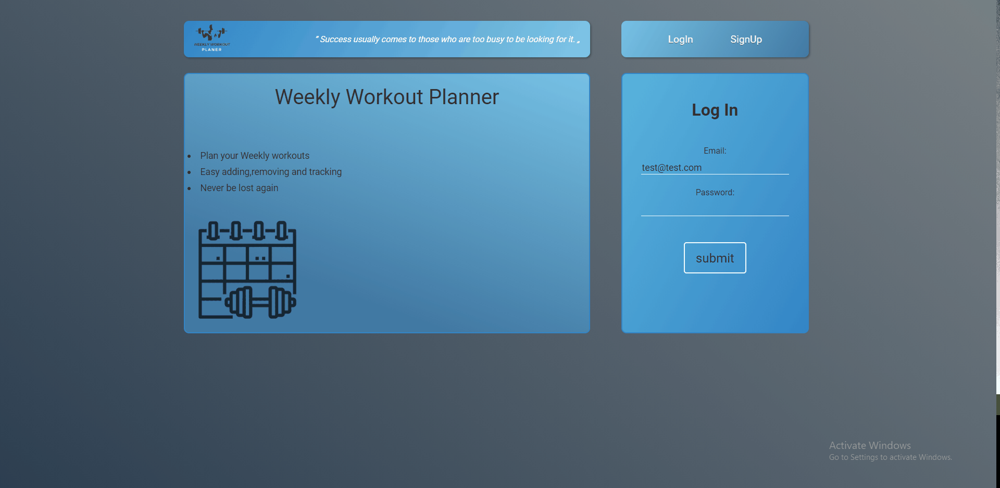

MERN app for creating weekly workout planner.
Create account, add favorite workouts for each day in week.
You can choose between cardio and weight workout, easy edit workout and delete if needed.

On backend is used node with express and mongoDB as database, notable libraries are bcryptjs for hashing password and jsonwebtoken for handling token auth. On frontend part is react, state management is handled with context api, all components are functional and styling is applied using css modules.

Technologies used: HTML, CSS, JavaScript, React, NodeJs, Express, mongoDB

##Live demo

https://weekly-workout-planner.herokuapp.com/login
